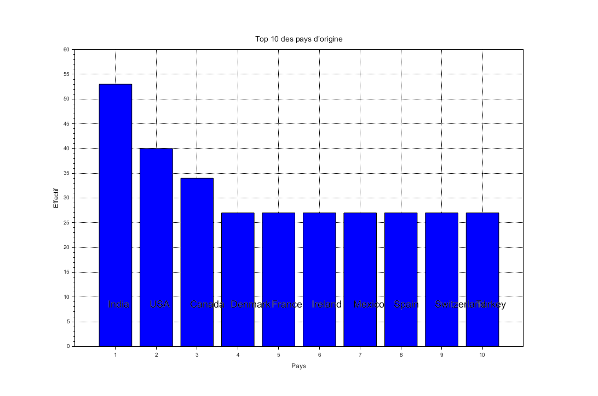
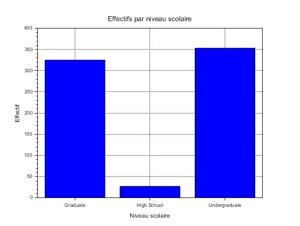
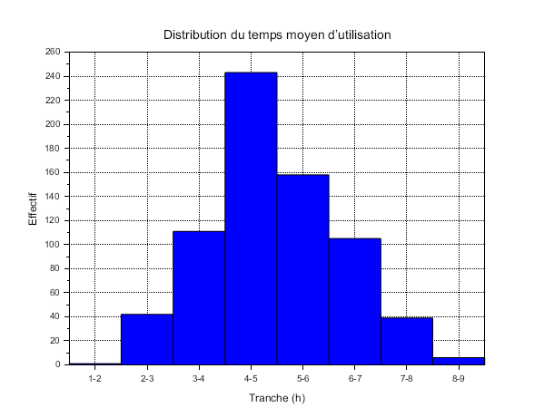
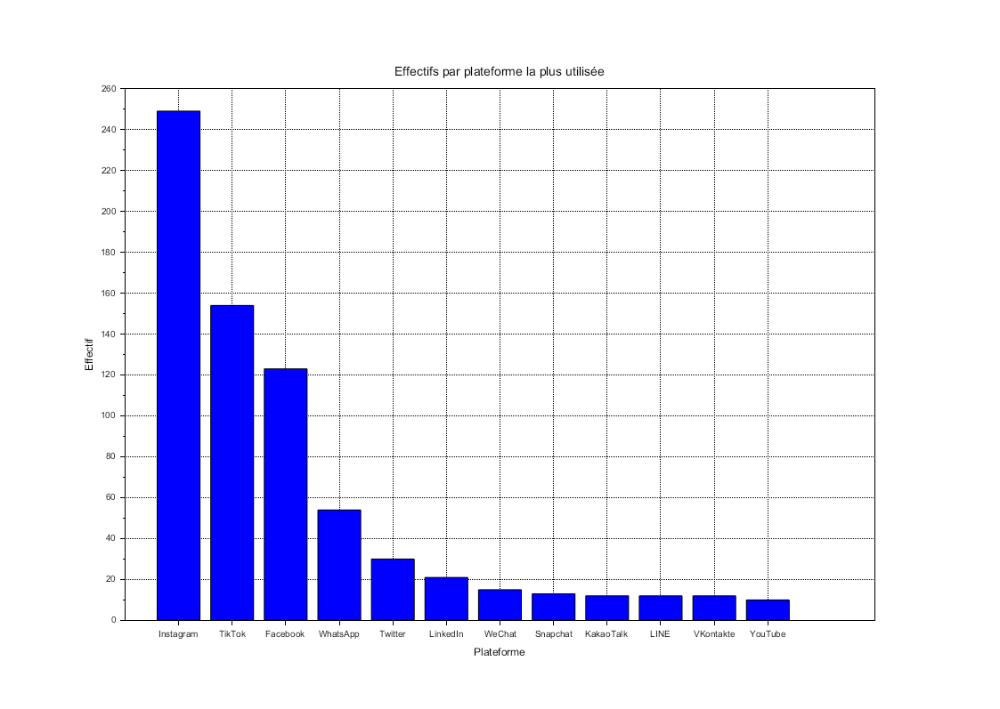

# Exercise 2 – Graphical Visualization

## Table of Contents

1. Question 1 – Ages by gender
2. Question 2 – Top 10 countries of origin
3. Question 3 – Academic levels
4. Question 4 – Distribution of average daily usage time
5. Question 5 – Most used platforms

---

## Question 1 – Ages by Gender

**[Scilab Script](scripts/ex2-question1.sce)**

```scilab
--> exec("EXERCICE2/scripts/ex2-question1.sce");
```


---

## Question 2 – Top 10 Countries of Origin

**[Scilab Script](scripts/ex2-question2.sce)**

```scilab
--> exec("EXERCICE2/scripts/ex2-question2.sce");
```



---

## Question 3 – Academic Levels

**[Scilab Script](scripts/ex2-question3.sce)**

```scilab
--> exec("EXERCICE2/scripts/ex2-question3.sce");
```



---

## Question 4 – Distribution of Average Daily Usage Time

**[Scilab Script](scripts/ex2-question4.sce)**

```scilab
--> exec("EXERCICE2/scripts/ex2-question4.sce");
```



---

## Question 5 – Most Used Platforms

**[Scilab Script](scripts/ex2-question5.sce)**

```scilab
--> exec("EXERCICE2/scripts/ex2-question5.sce");
```



---

## Folder Content

* **`scripts/`**
  Contains the Scilab `.sce` files used to automate the calculations for Q1 and Q2.

* **`img/`**
  Contains screenshots or graphs generated to illustrate the results.

* **`README.md`**
  This file: plan, instructions and links to scripts/images.