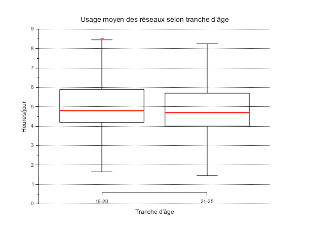
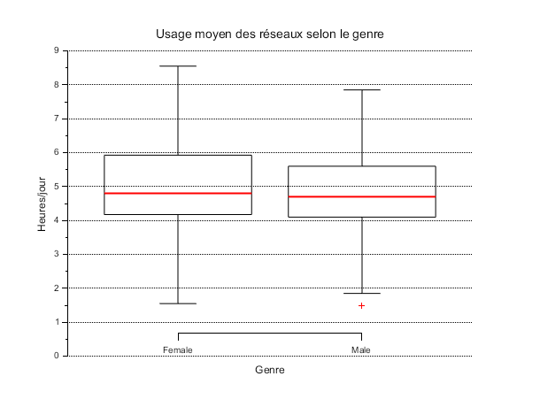
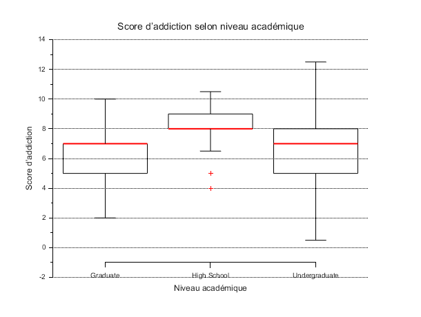

# Exercise 3 – Graphical Visualization

## Table of Contents

1. Question 1 – Usage by age groups
2. Question 2 – Usage by gender
3. Question 3 – Addiction by academic level

---

## Impact of usage duration on academic performance

Compare social media usage time between the two age groups: **[16–20]** and **[21–25]**.

## Table of Contents

---

## Question 1 – Usage by age groups

---

## Preamble

In order for the following script to run correctly, you need to install the boxplot library **stixbox**:

```scilab
atomsSystemUpdate();      // updates the ATOMS list
atomsInstall("stixbox");  // installs stixbox (only once)
atomsLoad("stixbox");     // loads stixbox into the session
```

---

**[Scilab Script](scripts/ex3-question1.sce) :**

```scilab
--> exec("EXERCICE3/scripts/ex3-question1.sce");
```



**Quick interpretation:**

* For **low usage**, very few students report a negative academic impact.
* As usage time increases, the number of students reporting a **decline** in their performance (the "Yes" bars) increases significantly.
* Conversely, the number of "No" decreases, illustrating a strong link between heavy usage and negative academic impact.

---

## Question 2 – Usage by gender

**[Scilab Script](scripts/ex3-question2.sce) :**

```scilab
--> exec("EXERCICE3/scripts/ex3-question2.sce");
```



The "Female" vs "Male" usage graph shows:

* Almost identical **median** (≈ 4.8 h for females, ≈ 4.7 h for males).
* Slightly larger **range** among females (extreme values up to 8.5 h vs ≈ 7.8 h for males).
* Very similar **variability**: the box widths are close, indicating comparable dispersion.
* **Outliers**: very low usage (~1.5 h) for one male, and very high usage (~8.5 h) for one female.

**Interpretation:**
Gender differences are minimal: average daily social media usage does not significantly differ between males and females, although female users present slightly more extreme values.

---

## Question 3 – Addiction by academic level

**[Scilab Script](scripts/ex3-question3.sce) :**

```scilab
--> exec("EXERCICE3/scripts/ex3-question3.sce");
```



The addiction score graph by academic level shows:

* **Graduate**

  * Median ≈ 7
  * Box (variance) from 5.5 to 8.5
  * A few extreme low (~2) and high (~10) values

* **High School**

  * Median ≈ 8
  * Tighter box: variance ≈ 7.5–9
  * Few outliers, overall high usage

* **Undergraduate**

  * Median ≈ 7
  * Wider variance (~5–8)
  * Largest score range (from ~0.5 to ~12.5)

**Interpretation:**

1. High school students show a slightly higher average addiction score (median ~8) than the other groups, with lower dispersion.
2. Undergraduate students have greater variability — some are barely addicted, others are highly addicted.
3. Graduate students fall in between: moderate median (~7) and intermediate dispersion.

🌟 **Conclusion**: The addiction score appears to vary depending on academic level, with the highest average addiction among high school students, a lower average among graduates, and the greatest dispersion among undergraduates.

---

## Folder Content

* **`scripts/`**
  Contains the Scilab `.sce` files used to automate calculations.

* **`img/`**
  Contains screenshots or graphs generated to illustrate the results.

* **`README.md`**
  This file: plan, instructions, and links to scripts/images.