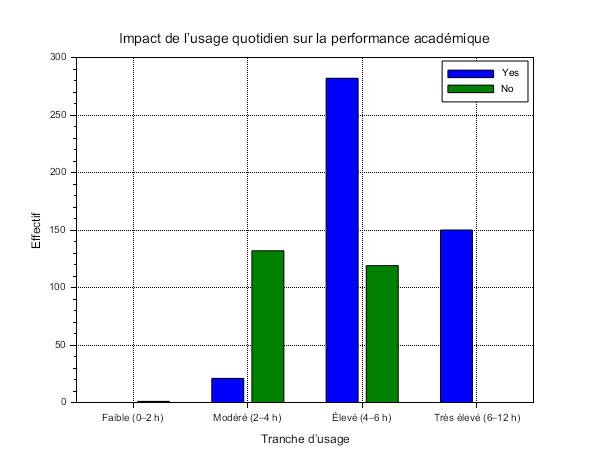

# Exercise 4 – Graphical Visualization

## Table of Contents

1. Question 1 – Impact of social media usage duration on academic performance

---

## Question 1 – Impact of usage duration on academic performance

We group usage into 4 categories:

* **Low**: 0–2 hours/day
* **Moderate**: 2–4 hours/day
* **High**: 4–6 hours/day
* **Very high**: 6–12 hours/day

**[Scilab Script](scripts/ex4-question1.sce):**

```scilab
--> exec("EXERCICE4/scripts/ex4-question1.sce");
```



The grouped bar chart below compares, for each usage range, the number of students whose academic performance is **affected** (“Yes”, in blue) versus **not affected** (“No”, in green).

| Usage range           | Low (0–2 h) | Moderate (2–4 h) | High (4–6 h) | Very high (6–12 h) |
| --------------------- | :---------: | :--------------: | :----------: | :----------------: |
| **Yes (affected)**    |      0      |        20        |      280     |         150        |
| **No (not affected)** |      1      |        132       |      119     |          0         |

**Graphical comparison**

* **Low (0–2 h)**: almost no impact (0 “Yes”, 1 “No”).
* **Moderate (2–4 h)**: most students do not see their performance decrease (132 “No” vs. 20 “Yes”).
* **High (4–6 h)**: clear turning point: 280 “Yes” versus 119 “No”.
* **Very high (6–12 h)**: massive usage correlated with systematic impact (150 “Yes”, 0 “No”).

> A clear breakpoint is observed around **4 hours per day**:
>
> * Below this threshold, social media usage remains mostly without academic impact.
> * Beyond it, it becomes harmful: the number of affected students explodes, reaching 100% for 6–12 hours/day.

---

## Folder Content

* **`scripts/`**
  Contains the script `ex4-question1.sce` to generate the chart.

* **`img/`**
  Contains the image `question1.png` illustrating the results.

* **`README.md`**
  This file: plan, instructions, and link to script/image.