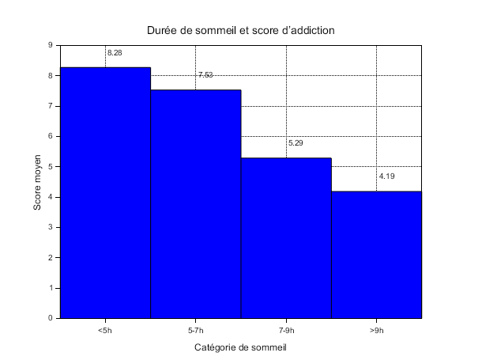

# Exercise 5 – Graphical Visualization V2

## Table of Contents

1. Question 1 – Addiction score vs sleep quality

---

## Question 1 – Addiction score according to sleep duration

Students are grouped into four categories:

* **< 5 h**
* **5–7 h**
* **7–9 h**
* **> 9 h**

**[Scilab Script](scripts/ex5-question1.sce):**

```scilab
--> exec("EXERCICE5/scripts/ex5-question1.sce");
```



The chart clearly shows that sleep quality (measured here in hour ranges) is inversely correlated with the average social media addiction score:

* **< 5 h** of sleep: average score ≈ 8.28
* **5–7 h**          : average score ≈ 7.53
* **7–9 h**          : average score ≈ 5.29
* **> 9 h**          : average score ≈ 4.19

---

### Analysis

**Decreasing effect**

* As the number of sleeping hours increases, the addiction score decreases almost linearly. Students sleeping less than 5 hours are the most “addicted” (8.28), while those sleeping more than 9 hours show the lowest average score (4.19).

**Critical threshold around 7 h:**

* A noticeable drop in the addiction score is observed when sleep duration goes beyond 7 hours. Moving from the 5–7 h range to the 7–9 h range causes the average score to drop from 7.53 to 5.29 (−30%).

**Implications:**

* Less rested individuals probably seek more stimulation or spend more time online to compensate for their fatigue.
* On the contrary, sufficient sleep (> 7 h) is associated with less excessive social media usage.

# **Conclusion:**

Good sleep seems to be important in countering social media addiction behaviors. Encouraging healthy sleeping habits could therefore help reduce compulsive online time.
The reverse correlation/causality also applies: addictive behaviors disrupt sleep rhythm and therefore sleep quality.

---

## Folder Content

* **`scripts/`**
  Contains the script `ex5-question1.sce` to generate the graph.

* **`img/`**
  Contains the image `question1.png` illustrating the results.

* **`README.md`**
  This file: plan, instructions, and link to script/image.