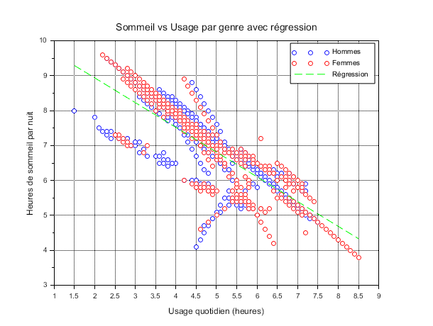
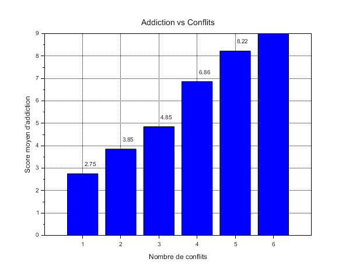

# Exercise 6 – Correlations Between Sleep, Usage and Conflicts

## Table of Contents

1. Sleep hours according to usage and gender
2. Conflicts vs addiction score

---

## 1. Sleep hours according to gender and usage time

**[Scilab Script](scripts/ex6-question1.sce)**

```scilab
--> exec("EXERCICE6/scripts/ex6-question1.sce");
```



**Graph description:**

* Each point represents a student: the x-axis corresponds to the number of hours he or she spends daily on social networks, and the y-axis to the number of hours of sleep per night.
* Blue circles represent males, red circles represent females.
* The green dashed line is the linear regression calculated on all the data, independently of gender.

**Consistent negative slope:**
The regression line has a clearly negative slope, which means that, on average, each additional hour spent on social networks leads to a decrease of about 0.25 hours (15 minutes) of sleep. This linear relationship captures the overall effect of excessive usage on night rest (note: this is simplified!).

**Similar dispersion between genders:**
The “male” and “female” point clouds spread very similarly around the trend line. Both genders show the same trade-off phenomenon between connected time and sleep: there is no systematic shift suggesting that one gender sleeps more or less for the same social media usage.

**Range of values:**

* At low usage (< 3 h/day), sleep durations generally range between 7 h and 9 h.
* At medium usage (3–6 h/day), sleep ranges between 5 h and 8 h, with a concentration around 6 h to 7 h.
* At high usage (> 6 h/day), most points fall below 6 h of sleep, some even around 4 h.

> **Conclusion:**
> There is a strong inverse relationship between time spent on social networks and night sleep duration, valid for both men and women. This linear effect suggests that reasonable screen time management is essential to preserve sufficient sleep.
> To limit the risks of insomnia and daytime fatigue, it would be wise to set daily usage limits (for example 2–3 hours), or to introduce a digital detox (hehe)!

---

## 2. Addiction score and conflicts

**[Scilab Script](scripts/ex6-question3.sce)**

```scilab
--> exec("Exercise6/scripts/ex6-question3.sce");
```



On this last graph, we clearly observe a **positive relationship** between the number of conflicts related to social networks and the average addiction score:

<div align="center">

On this last graph, we clearly observe a **positive relationship** between the number of conflicts related to social networks and the average addiction score:

| Number of conflicts | Average addiction score |
| :-----------------: | :---------------------: |
|          1          |           2.75          |
|          2          |           3.85          |
|          3          |           4.85          |
|          4          |           6.86          |
|          5          |           8.22          |
|          6          |           9.00          |

</div>

* **General trend:** As the number of conflicts increases, the addiction score rises from about 2.8 (for 1 conflict) to 9.0 (for 6 conflicts).
* **Critical threshold:** A particularly sharp increase is observed starting from 4 conflicts: the average score jumps from ~4.9 (3 conflicts) to ~6.9 (4 conflicts), then rises again towards 9 for 6 conflicts.
* **Plausible causal interpretation:**

  * **Addiction → Conflicts:** Compulsive use of social networks can lead to family or friendship disputes about time spent online, hence the increase in the number of conflicts.
  * **Conflicts → Reinforced usage:** Tensions can push some individuals to seek comfort even more in social networks, which can further worsen addiction.

> **Conclusion:**
> There is a vicious circle: the more one is “addicted” to social networks, the more conflicts around this usage are generated, and the more these conflicts can, in turn, reinforce compulsive usage. Breaking this cycle requires screen time regulation strategies.

---

## Folder Content

* **`scripts/`**
  Contains the Scilab `.sce` files used to automate the calculations for exercise 6.

- **`img/`**
  Contains the screenshots or `.scg` graphs generated to illustrate the results.

* **`README.md`**
  This file: plan, exercise description, and link to script/image.