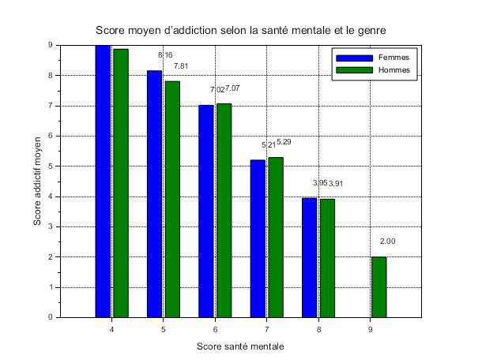

# Exercise 7 – Selected comparison: Average addiction score according to mental health and gender

## Table of Contents

1. Question 1 – Average addiction score according to mental health and gender

---

## Question 1 – Average addiction score according to mental health and gender

**[Scilab Script](scripts/ex7-question1.sce):**

```scilab
--> exec("EXERCICE5/scripts/ex7-question1.sce");
```



The graph above compares, for each value of the **mental health score**, the **average addiction score**, separately for **women** (blue bars) and **men** (green bars):

---

### Key points

**General inverse trend.**
We observe a **negative relationship** between mental health score and addiction score:

* At **high mental health scores** (8–9), the average addiction score is **very low** (~ 3–4 for women, ~ 3–4 for men).
* At **low mental health scores** (4–5), the average addiction score increases **significantly** (≈ 8–9).

> **Conclusion:** the more a student is addicted to social networks, the more their mental well-being tends to deteriorate.

**Comparison Women vs Men**

* For each mental health category, **women** show a **slightly higher** addiction score than men (blue bars always a bit higher).
* The gap is largest around the mental health score of **5** (≈ 8.2 vs 7.8) and decreases at the extremes.

**Variations**

* Moving from mental health score 4 to 5 results in a decrease of the average addiction by nearly **1 point**.
* Between 6 and 7, the difference is more moderate (< 0.1 point), representing **a stabilization zone** at intermediate values.
* Beyond 7, the slope becomes steeper again, reaching an average score close to **4** for a mental health score of 9.

---

In short, we observe:

* **Low social media use** → **preserved mental health**
* **High social media use** → **increased risk** of psychological distress

This link, more pronounced among women, supports the need for awareness about digital addiction in order to preserve mental balance.

---

## Folder Content

* **`scripts/`**
  Contains the script `ex7-question1.sce` to generate the chart.

* **`img/`**
  Contains the `question1.png` image illustrating the results.

* **`README.md`**
  This file: plan, exercise description, and link to script/image.